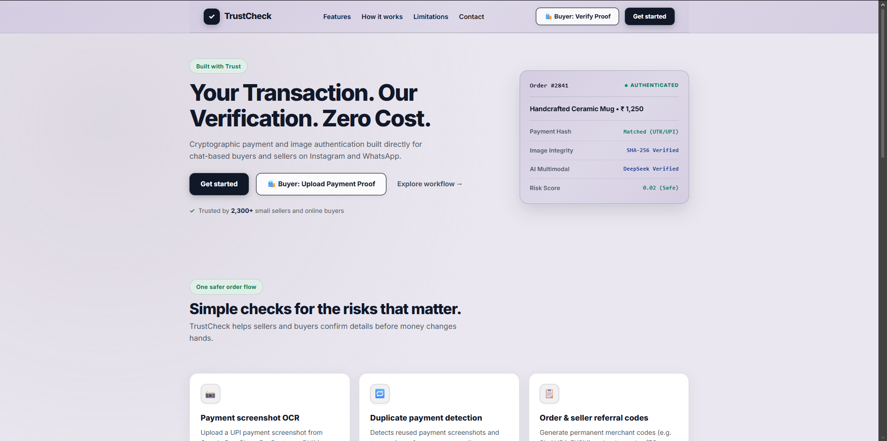
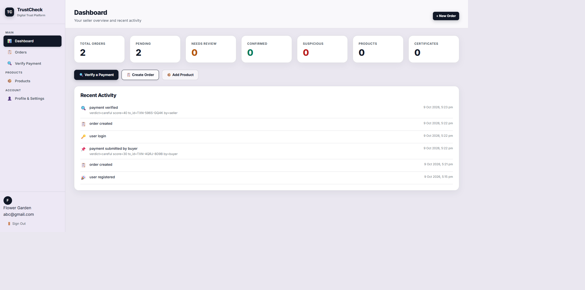
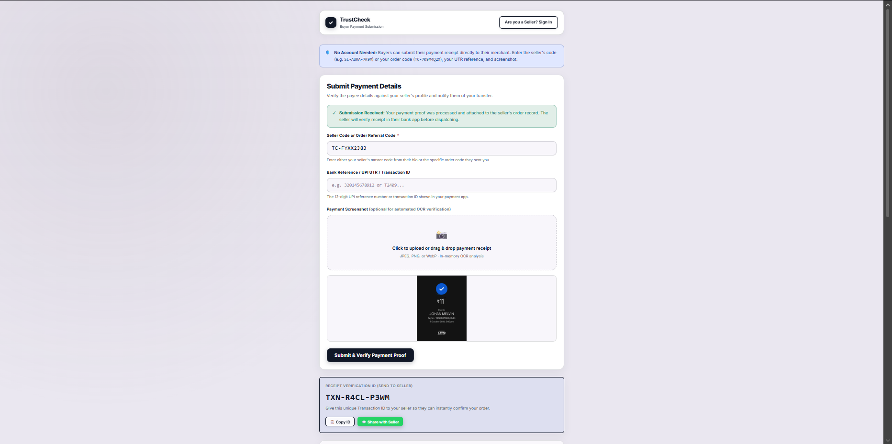

# TrustCheck — Digital Payment Fraud Detection for Social Commerce

*OPCODE IMPACT 2026 | Hackathon Submission*

*Team ID:* [OPC007]

---

## 1. Problem Statement

Independent sellers on Instagram and WhatsApp lose money daily to payment fraud. Buyers submit **fake UPI payment screenshots**, reuse old transaction receipts across multiple orders, or socially engineer sellers into releasing goods before funds actually arrive. There is no lightweight, accessible tool that lets a small seller forensically verify a payment proof without advanced technical knowledge — until now.

---

## 2. Solution Title

**TrustCheck** — AI-Powered Payment Screenshot Verification & Fraud Risk Platform

---

## 3. Solution Description

TrustCheck is a full-stack fraud-risk assessment platform built specifically for social commerce merchants. When a buyer claims to have paid, the seller simply enters their order code and uploads the screenshot. TrustCheck runs it through a **DeepSeek V4.1 Flash multimodal AI vision pipeline** that extracts amount, payee name, UPI ID, transaction ID, and date — then cross-checks every field against the original order record and scores the result for fraud risk.

Key capabilities:
- **AI screenshot analysis** — DeepSeek multimodal AI reads payment details from any UPI app screenshot (Google Pay, PhonePe, Paytm, BHIM) with structured JSON output; automatically falls back to **RapidOCR** (pure-Python, no system dependencies) if the AI is unavailable
- **Dual referral code system** — every seller gets a permanent `SL-XXXX-XXXX` bio code; each order generates a unique `TC-XXXXXXXX` code, eliminating QR spoofing
- **Image forensics** — SHA-256 digest, perceptual hashing (pHash), and Error Level Analysis detect screenshot edits and duplicate resubmissions
- **Zero-storage privacy** — raw payment images are processed entirely in-memory and never written to disk or database; only mathematical fingerprints are persisted
- **Certified product photos** — sellers cryptographically fingerprint their original product images to an append-only hash-linked audit ledger, protecting against counterfeit storefronts

---

## 4. Architecture Diagram

```
┌─────────────────────────────────────────────────────────────────────┐
│                   Frontend (Vanilla HTML / CSS / JS)                │
│      Landing · Dashboard · Orders · Verify Payment · Products       │
└──────────────────────────────┬──────────────────────────────────────┘
                               │  REST API  (Bearer JWT)
┌──────────────────────────────▼──────────────────────────────────────┐
│                   FastAPI Backend  (Python 3.10+)                   │
│                                                                     │
│  Auth · Orders · Payments · Products · Seller · Dashboard Routers   │
└──────────────────────────────┬──────────────────────────────────────┘
                               │
┌──────────────────────────────▼──────────────────────────────────────┐
│                  AI Vision & Analysis Subsystems                    │
│                                                                     │
│  1. DeepSeek V4.1 Flash Multimodal AI  (structured JSON extraction) │
│  2. RapidOCR + OpenCV  (pure-Python fallback, no system binary)     │
│  3. Image Forensics  (SHA-256, pHash, ELA, EXIF)                    │
│  4. HMAC-SHA256 Anti-Replay Deduplication Engine                    │
│  5. Hash-Linked Append-Only Audit Ledger                            │
│  6. PostgreSQL (Supabase cloud) / SQLite (local development)         │
└─────────────────────────────────────────────────────────────────────┘
```

**Workflow:** Buyer claims payment → Seller enters order code + uploads screenshot → AI vision extracts all payment fields in-memory → system cross-checks amount, payee, and transaction ID against the order record → forensics engine checks for edits and duplicate reuse → risk verdict (`genuine / careful / suspicious`) returned to seller with detailed breakdown.

---

## 5. Technology Stack

- **Frontend:** Vanilla HTML5, CSS3, JavaScript — dark cybersecurity design system, served directly by FastAPI via Starlette `StaticFiles`
- **Backend:** Python 3.10+, FastAPI, SQLAlchemy 2.0, Pydantic v2, Uvicorn
- **Database:** Supabase PostgreSQL in deployment, SQLite for local development and tests; multi-tenant isolation is enforced via `seller_id` on every query
- **AI / Vision:**
  - DeepSeek V4.1 Flash (multimodal, via OpenAI-compatible API)
  - RapidOCR (ONNX runtime, pure-Python fallback)
  - OpenCV + Pillow (image preprocessing pipeline)
- **Security:** JWT (PyJWT + bcrypt), HMAC-SHA256 transaction fingerprinting, pHash perceptual hashing, Error Level Analysis (ELA)
- **Other:** pytest (test suite), python-dotenv / pydantic-settings (config)

---

## 6. Quick Start Guide

**Prerequisites:**
- Python 3.10 or newer
- No system OCR binaries needed — RapidOCR runs entirely in Python

**Installation & Execution:**

```bash
# 1. Clone the repository
git clone https://github.com/ibadhrahman/trustcheck.git
cd trustcheck

# 2. Create and activate a virtual environment
python -m venv .venv

# Windows:
.\.venv\Scripts\activate
# Linux / macOS:
source .venv/bin/activate

# 3. Install all dependencies
pip install -r requirements.txt

# 4. Set up environment config
cp .env.example .env
# (Optional) Edit .env to add DEEPSEEK_API_KEY for AI vision
# The app works without it using the built-in RapidOCR fallback

# To use the linked Supabase project, set DATABASE_URL in .env to the
# PostgreSQL URI from Supabase Dashboard → Project Settings → Database → Connect.
# Use the Session pooler URI if your network does not support IPv6, and keep the
# database password only in .env. The backend creates/updates its schema at startup.

# 5. Seed demo data (creates test seller accounts and orders)
# Run this only for a local/demo database; it writes into DATABASE_URL.
python scripts/seed_demo.py

# 6. Start the development server
uvicorn app.main:app --reload --port 8000
```

Open **http://localhost:8000** in your browser.

The app connects to Supabase through SQLAlchemy and psycopg when `DATABASE_URL`
contains a PostgreSQL URI. Supabase tables are kept unavailable to the browser
Data API; requests continue through the authenticated FastAPI backend. SQLite
remains the default for local development and automated tests.

**Demo login:**
| Email | Password |
|---|---|
| `seller@artisan.in` | `Password123!` |
| `rohit@vintageleather.in` | `Password123!` |

---

## 7. Output Screenshots

> Add screenshots to the `docs/` folder and update the paths below.





The seller uploads a buyer's payment screenshot. TrustCheck's AI vision engine extracts all payment details, compares them against the order record, runs forensic checks, and returns a fraud-risk verdict with an itemised breakdown — all within seconds, with no raw image ever stored.

---

## 8. Future Scope

- **WhatsApp / Telegram bot integration** — let buyers submit screenshots directly in the chat without needing a browser
- **Multiple payment app templates** — expand forensic template matching for CRED, Amazon Pay, and international SWIFT remittances
- **Merchant analytics dashboard** — trend analysis of fraud attempts per time period, product category, and buyer region
- **Mobile PWA** — offline-capable progressive web app for sellers with low connectivity
- **Federated blocklist** — opt-in, privacy-preserving sharing of HMAC-fingerprinted fraudulent transaction references across the seller network

---

## 9. Team Contributions

| Member Name | Contribution |
|---|---|
| Johan | UI/UX design, frontend layout and component design |
| Jishin | Frontend development, page implementation and styling |
| Ibadh | Backend architecture, FastAPI routers, database schema, referral code system |
| Haani | AI vision integration (DeepSeek), OCR pipeline, image forensics, authentication |

---

## 10. Tools Used

| Tool / Platform | Purpose / Why Used |
|---|---|
| Python / FastAPI | High-performance async backend with automatic OpenAPI docs |
| SQLite + SQLAlchemy 2.0 | Lightweight relational database with ORM; no server setup needed |
| DeepSeek V4.1 Flash | Multimodal AI — reads and understands payment screenshots as structured data |
| RapidOCR (ONNX) | Pure-Python OCR fallback; works without Tesseract system binary |
| OpenCV + Pillow | Image preprocessing (CLAHE, adaptive thresholding) to improve OCR accuracy |
| JWT + bcrypt | Stateless authentication and secure password storage |
| pHash + ELA | Perceptual hashing and Error Level Analysis to detect fake/edited screenshots |
| HMAC-SHA256 | Privacy-safe transaction fingerprinting — cleartext IDs are never stored |
| Pytest | Automated test suite — 31 tests covering auth, orders, forensics, AI schema |
| Vanilla HTML/CSS/JS | Zero-dependency frontend; fast, lightweight, no build step required |
| GitHub Copilot / AI IDEs | Assisted with boilerplate generation, regex patterns, and test scaffolding |
